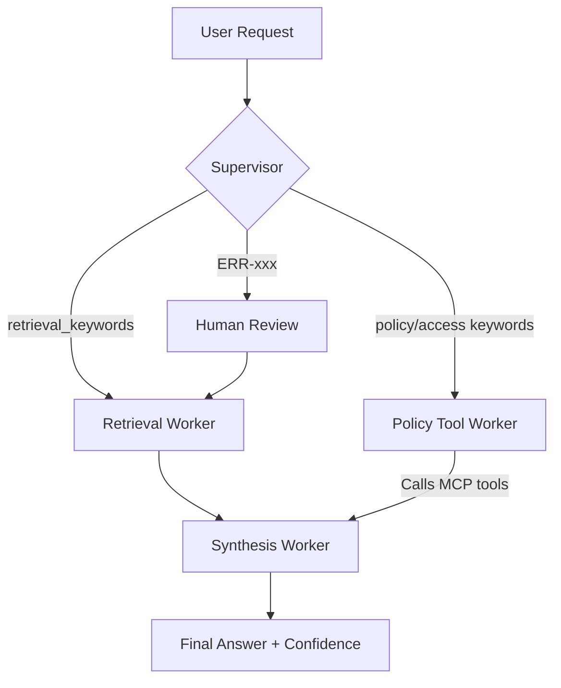

# System Architecture — Lab Day 09

**Nhóm:** Nhóm 15  
**Ngày:** 2026-04-14  
**Version:** 1.0

---

## 1. Tổng quan kiến trúc

> Mô tả ngắn hệ thống của nhóm: chọn pattern gì, gồm những thành phần nào.

**Pattern đã chọn:** Supervisor-Worker  
**Lý do chọn pattern này (thay vì single agent):**

Hệ thống có nhiều loại task phức tạp khác nhau: tra cứu tài liệu thông thường, áp dụng chính sách, kiểm tra quyền truy cập khẩn cấp. Do RAG truyền thống quá tải và nguyên khối (monolith), việc tách theo role (Retrieval, Policy validation) trong đó Supervisor điều hướng cho từng context riêng biệt giúp dễ bảo trì lỗi và trace được data rõ ràng, tránh hallucination của LLM trên context lớn.

---

## 2. Sơ đồ Pipeline

> Vẽ sơ đồ pipeline dưới dạng text, Mermaid diagram, hoặc ASCII art.
> Yêu cầu tối thiểu: thể hiện rõ luồng từ input → supervisor → workers → output.

**Sơ đồ thực tế của nhóm:**

---

## 3. Vai trò từng thành phần

### Supervisor (`graph.py`)

| Thuộc tính | Mô tả |
|-----------|-------|
| **Nhiệm vụ** | Phân tích query và đưa ra quyết định chuyển cho Worker nào xử lý thông qua routing rules. |
| **Input** | `state["task"]` (Câu hỏi người dùng) |
| **Output** | `supervisor_route`, `route_reason`, `risk_high`, `needs_tool` |
| **Routing logic** | Sử dụng Pattern Keyword Matching array (`policy_keywords`, `retrieval_keywords`, `risk_keywords`). |
| **HITL condition** | Trạng thái bắt gặp dạng log lỗi phần mềm chưa được define hoặc prefix `ERR-xxx`. |

### Retrieval Worker (`workers/retrieval.py`)

| Thuộc tính | Mô tả |
|-----------|-------|
| **Nhiệm vụ** | Tìm kiếm dữ liệu và bối cảnh (context chunks) dựa trên dữ liệu lưu trữ từ ChromaDB. |
| **Embedding model** | SentenceTransformer (`all-MiniLM-L6-v2`) |
| **Top-k** | 3 chunks |
| **Stateless?** | Yes |

### Policy Tool Worker (`workers/policy_tool.py`)

| Thuộc tính | Mô tả |
|-----------|-------|
| **Nhiệm vụ** | Đánh giá query có thuộc policy không và gọi external tools MCP để kiểm tra SLA / Exception. |
| **MCP tools gọi** | `search_kb`, `check_access_permission`, `get_ticket_info` |
| **Exception cases xử lý** | Exceptions về hạn Refund (Flash Sale rules, Digital Product). |

### Synthesis Worker (`workers/synthesis.py`)

| Thuộc tính | Mô tả |
|-----------|-------|
| **LLM model** | Trình gọi Prompt (Sử dụng OpenAI module / fallback handle). |
| **Temperature** | 0.0 (giới hạn Hallucination nhất có thể) |
| **Grounding strategy** | Đính kèm `retrieved_chunks` cùng `policy_result` vào context prompt. |
| **Abstain condition** | Nếu context rỗng hoặc fail MCP validation, xuất output abstain mặc định. |

### MCP Server (`mcp_server.py`)

| Tool | Input | Output |
|------|-------|--------|
| search_kb | query, top_k | chunks, sources |
| get_ticket_info | ticket_id | ticket details |
| check_access_permission | access_level, requester_role | can_grant, approvers, rules |

---

## 4. Shared State Schema

> Liệt kê các fields trong AgentState và ý nghĩa của từng field.

| Field | Type | Mô tả | Ai đọc/ghi |
|-------|------|-------|-----------|
| task | str | Câu hỏi đầu vào | supervisor đọc |
| supervisor_route | str | Worker được chọn | supervisor ghi, graph đọc |
| route_reason | str | Lý do route | supervisor ghi |
| retrieved_chunks | list | Evidence từ retrieval | retrieval ghi, synthesis đọc |
| policy_result | dict | Kết quả kiểm tra policy | policy_tool ghi, synthesis đọc |
| mcp_tools_used | list | Tool calls đã thực hiện | policy_tool ghi, trace đọc |
| final_answer | str | Câu trả lời cuối | synthesis ghi |
| confidence | float | Mức tin cậy của Agent | synthesis ghi |
| risk_high | bool | Đánh dấu sự cố hoặc cần kiểm tra | supervisor ghi |
| hitl_triggered | bool | Trạng thái dừng đợi người duyệt | human_review ghi |

---

## 5. Lý do chọn Supervisor-Worker so với Single Agent (Day 08)

| Tiêu chí | Single Agent (Day 08) | Supervisor-Worker (Day 09) |
|----------|----------------------|--------------------------|
| Debug khi sai | Khó — không rõ lỗi ở đâu | Dễ hơn — test từng worker độc lập thông qua `worker_io_logs` |
| Thêm capability mới | Phải sửa toàn prompt dẫn đến rủi ro | Thêm worker/MCP tool riêng rẻ biệt |
| Routing visibility | Không có | Có đầy đủ thông tin `route_reason` và `workers_called` trong trace |
| Tính ổn định ngữ cảnh| LLM nhầm lẫn giữa Policy logic vs FAQ | Context được inject chính xác sau bước xác thực tools |

**Nhóm điền thêm quan sát từ thực tế lab:**
Khả năng mở rộng được cải thiện đáng kể. Đối với Supervisor model, việc thêm một bước lọc rủi ro `risk_high` là cực kì hữu ích với các module liên quan đến access admin trong công ty, những policy có thể được trigger ngay nếu phát hiện risk khẩn cấp mà không cần đi qua khâu Retrieval rườm rà.

---

## 6. Giới hạn và điểm cần cải tiến

> Nhóm mô tả những điểm hạn chế của kiến trúc hiện tại.

1. Keyword matching đang hardcode, thiếu tính Semantic. Nếu user dùng từ đồng nghĩa như "đòi lại tiền" thay cho "hoàn tiền", supervisor sẽ push fallback qua retrieval gây mất mát luồng Policy Check.
2. Dữ liệu State truyền lớn. State lưu lịch sử toàn bộ các bước IO, có thể chậm nếu string length payload giữa các node trở nên khổng lồ.
3. Node `Supervisor` có thể quá cứng ngắc, về lâu dài nên nâng cấp lên Router Node LLM nếu chi phí API không còn là rào cản.
